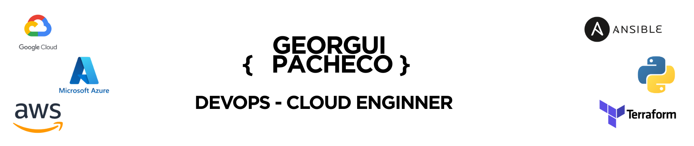

# 👋 Hi there! Welcome to my GitHub profile

I’m passionate about **automation, cloud computing, and software development**, with hands-on experience in **DevOps, Cloud Platforms, and Full-Stack Development**. 🚀  

---

## 🛠️ Tech Stack & Tools

  <!-- Cloud -->
  
  
  
  
  

    

  <!-- IaC & Automation -->
  
  
  
  
  
  
  

    

  <!-- CI/CD & Tools -->
  
  
  
  
  
  
  

    

  <!-- Programming -->
  
  
  

---

## 📊 GitHub Stats

  
   
  

---

## 🌍 Connect with Me

  

---

✨ *Always learning, building, and sharing knowledge in the world of Cloud and DevOps.*  
